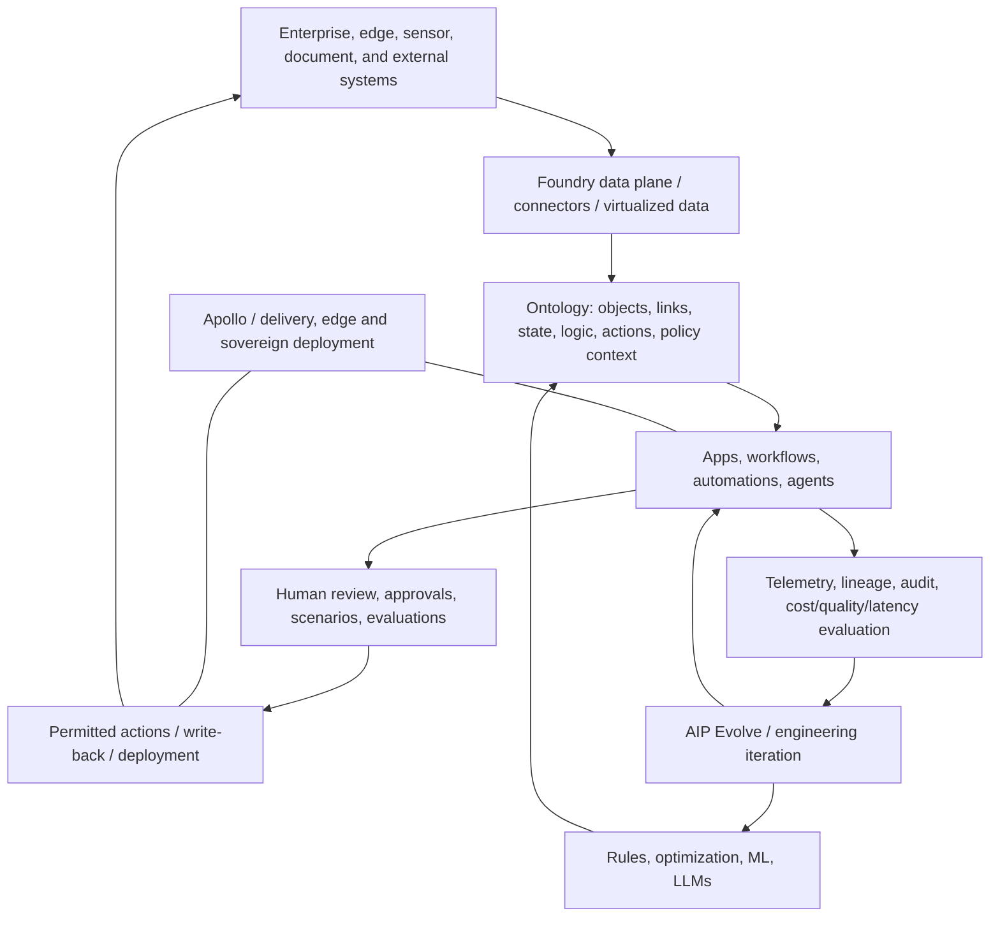

# Terra Review A — Palantir operational-AI architecture

**Scope.** This reconstruction covers the 100-video catalog snapshot dated 2026-07-14, spanning 2025-08-25 through 2026-07-14. It uses the catalog, the 100 indexed video reviews, all ten batch-run artifacts, and the 25 supplied caption transcripts. `V###` links identify catalog videos; `†` in the coverage ledger marks a supplied transcript. This is a first-party evidence review, not an independent product or performance assessment.

**Confidence vocabulary.** **High** means directly supported by one or more transcripts (or repeated, mutually consistent primary descriptions); **Medium** means repeated official descriptions but no transcript for the key integration detail; **Low** means a launch/vision claim, event framing, or an inference from a described demonstration. Quantified results throughout the corpus are speaker or publisher claims and are not independently validated.

## Executive reconstruction

Palantir presents a stack for turning heterogeneous enterprise and mission data into governed, operational decisions—not a standalone model-serving product. Its central abstraction is the **Ontology**: a semantic model of the business's entities, relationships, current state, decision logic, and permitted actions. Foundry/AIP connect source systems, models and users to that layer; applications, workflows and agents use it to make and execute decisions; Apollo delivers software across heterogeneous and sovereign estates. The July 2026 DevCon launch makes previously distributed production-agent concerns into named layers: Agent Engine/SDK build stateful agents, Orchestrator provides durable execution, Agent Manager/Inspect provide telemetry, and AIP Evolve optimizes quality/cost/latency. **Confidence: High** for the broad decomposition; **Medium** for the exact product/API boundaries. [V074](https://www.youtube.com/watch?v=YDAxITCNcko) [V008](https://www.youtube.com/watch?v=mDGjptFvePY) [V009](https://www.youtube.com/watch?v=ZTw66mjYATo) [V010](https://www.youtube.com/watch?v=6_6OvDIET_w)

The architecture is best read as a **closed operational loop**:

1. Ingest or virtualize fragmented data and retain its operational meaning.
2. Model entities, relationships, policies, logic, and allowable actions in the Ontology.
3. Let deterministic optimization, ML, and LLM/agent reasoning operate over that context.
4. Require review, approval, simulations, or other gates at consequential points.
5. Commit approved actions back to systems of record or field operations.
6. Observe traces, outcomes, lineage and costs; use evaluations to improve the workflow.

This loop is evidenced at the platform level by the Ontology overview (data + logic + action; write-back to SAP/plant/financial systems) and at application level by factory scheduling, clinical operations, security remediation, supply-chain control towers, and network planning. **Confidence: High** for the loop's ingredients; **Medium** that every product follows every step. [V074](https://www.youtube.com/watch?v=YDAxITCNcko) [V088](https://www.youtube.com/watch?v=-DPdyQR1bG4) [V091](https://www.youtube.com/watch?v=DLx3ix6c0Oo) [V021](https://www.youtube.com/watch?v=NLsXIIkGJ4o)

The diagram is a synthesis, not a published topology. The strongest support for its core is [V074](https://www.youtube.com/watch?v=YDAxITCNcko); the named agent and delivery layers are supported by [V001](https://www.youtube.com/watch?v=IDZVaKc6MGQ), [V005](https://www.youtube.com/watch?v=elzenOIEdtI), [V007](https://www.youtube.com/watch?v=GZHSCMz6Aio), [V008](https://www.youtube.com/watch?v=mDGjptFvePY), and [V009](https://www.youtube.com/watch?v=ZTw66mjYATo). **Confidence: Medium** for the composite diagram.

## Component relationships

### 1. Data and compute substrate

Foundry is the recurring data/operational substrate: it connects legacy, packaged, cloud, on-premises and edge systems; supports data transformation and compute alternatives; and exposes provenance/branches in the development stories. The Ontology overview explicitly describes connectors and virtualization for Snowflake, Databricks and BigQuery, while the lightweight-transform demos show engine choice (DuckDB, Polars, pandas, DataFusion and pushdown) as an efficiency concern rather than a separate user-facing AI product. **Confidence: High** for multi-system connection and varied compute; **Medium** for a single unified “data plane” implementation. [V074](https://www.youtube.com/watch?v=YDAxITCNcko) [V081](https://www.youtube.com/watch?v=PGNWo-UuXLs) [V100](https://www.youtube.com/watch?v=MITSJDI08R4) [V061](https://www.youtube.com/watch?v=wOyByRnOgIc)

The corpus does not support treating this as mandatory data centralization. NHS FDP is explicitly described as separate, locally controlled instances sharing a Canonical Data Model, with data able to remain at its sovereign organization and be queried when needed. That is evidence for **semantic federation**—a common operational interface over distributed data—not evidence for one physical global store. **Confidence: High.** [V059](https://www.youtube.com/watch?v=NANvLfyDQBI)

### 2. Ontology as semantic decision-and-action plane

The Ontology is the architectural center, not merely a knowledge graph or data catalog. The direct description defines it as the business's “nouns and verbs” and joins: (a) data representing current state, (b) logic such as rules, spreadsheets, forecasts, ML and third-party optimizers, and (c) actions that affect the real system. It can model a warehouse, a patient/card, a vehicle, a manufacturing BOM, a case, or an operational mission with the context and action surface appropriate to that domain. **Confidence: High.** [V074](https://www.youtube.com/watch?v=YDAxITCNcko) [V092](https://www.youtube.com/watch?v=dQ8KeyVmfUM) [V094](https://www.youtube.com/watch?v=mKp3TTggihU) [V097](https://www.youtube.com/watch?v=mBDQK7OJ1Ls)

This makes the Ontology the coupling point between deterministic and generative computation. The video explicitly says an LLM can receive business context, call a deterministic model, then drive an action; the tariff and health-care examples show model-based extraction/reasoning alongside retained human judgment and an operational record. **Confidence: High** for the stated capability; **Medium** for how uniformly it is available across products. [V074](https://www.youtube.com/watch?v=YDAxITCNcko) [V085](https://www.youtube.com/watch?v=xBTPNLd8Jv8) [V094](https://www.youtube.com/watch?v=mKp3TTggihU)

### 3. Applications, automations, and domain operating systems

Palantir's repeatable product shape is a domain **operating system/control tower**, not an isolated assistant. Examples connect a shared object model to cross-functional workflows: Hertz fleet state across safety, maintenance, transport and allocation; American Airlines network planning across schedule, crew, aircraft and simulation; bp assets across sensors, engineering practice and maintenance; and Warp Speed across design, BOM/MRP/PLM/MES, planning, quality and production. **Confidence: Medium** (mostly description-backed; direct caption support is strongest for American and bp). [V023](https://www.youtube.com/watch?v=kqpzUGtZvNI) [V091](https://www.youtube.com/watch?v=DLx3ix6c0Oo) [V090](https://www.youtube.com/watch?v=1Wrhaur3ws0) [V076](https://www.youtube.com/watch?v=mfmD1QqnaKg)

Many applications are explicitly built with forward-deployed, domain-expert teams. The observed architectural implication is a delivery method: encode a customer's actual decisions, data and action boundaries in a reusable operational model, then add workflows/apps rather than replace every existing system. **Confidence: Medium.** [V014](https://www.youtube.com/watch?v=D5t6384lqoE) [V055](https://www.youtube.com/watch?v=e90qUUh8_us) [V096](https://www.youtube.com/watch?v=AsTpgn1Bd2o)

### 4. AIP and the production-agent stack

AIP is the family that places models and agentic reasoning inside the Ontology-backed workflow. Earlier videos show agents proposing schedules, extracting documents, triaging supply-chain events, helping plan clinical work and coordinating distributed decisions. The latest releases sharpen this into a named stack:

- **Agent Engine / Agent SDK**: strongly typed context items, state-change events, and external effects; presented as a distributed-state-machine foundation for multi-participant agents. **Confidence: Medium** (description-only).
- **Orchestrator**: durable execution for crash/recovery, waits and resumption, with claimed avoidance of lost state/duplicate effects and idle compute while awaiting approval. **Confidence: Medium** (description-only).
- **Agent Manager, AIP Inspect and Agent Timeline**: telemetry and readable execution narratives. A prior captioned AIP observability video substantiates cross-product traces, logs, metrics, alerting, a central store, and OpenTelemetry export. **Confidence: High** for observability capabilities; **Medium** for the precise relationship of the new product names.
- **AIP Evolve**: uses enterprise evaluations to compare model, prompt and architectural changes; it may substitute deterministic logic or structured Ontology data for an LLM call. **Confidence: Medium** (published demos; optimization method and guardrails not fully exposed).

[V008](https://www.youtube.com/watch?v=mDGjptFvePY) [V009](https://www.youtube.com/watch?v=ZTw66mjYATo) [V010](https://www.youtube.com/watch?v=6_6OvDIET_w) [V007](https://www.youtube.com/watch?v=GZHSCMz6Aio) [V082](https://www.youtube.com/watch?v=9IgYLjxxesw) [V006](https://www.youtube.com/watch?v=WLleqr4GEAw) [V032](https://www.youtube.com/watch?v=p0pjtkg1ny4)

### 5. Trust, governance, and human control

Governance is represented as a functional layer through the stack, rather than a final compliance report. Evidence includes purpose-based access controls and local control in NHS FDP; granular access, investigation scope, selective revelation, retention/deletion, immutable audit and lineage in the privacy history; explicit human adjudication in security remediation; and approval/merge steps in scenarios, manufacturing scheduling and AI-assisted data changes. **Confidence: High** that these mechanisms are product/design aims and demonstrated patterns; **Low–Medium** that they compose into one consistent enforcement service. [V059](https://www.youtube.com/watch?v=NANvLfyDQBI) [V099](https://www.youtube.com/watch?v=x-NEdIcgboo) [V021](https://www.youtube.com/watch?v=NLsXIIkGJ4o) [V004](https://www.youtube.com/watch?v=mZcpr3vX_XY) [V088](https://www.youtube.com/watch?v=-DPdyQR1bG4) [V100](https://www.youtube.com/watch?v=MITSJDI08R4)

The recurring operating posture is **graduated autonomy**: agents first assist or propose, humans decide on consequential actions, feedback becomes reusable context, and automation may expand with trust. That resolves the apparent tension between “self-healing/autonomous enterprise” messaging and repeated approval gates at the level of strategy—but not at the level of technical policy enforcement, which is not fully disclosed. **Confidence: Medium.** [V060](https://www.youtube.com/watch?v=8qXIoUxisxk) [V064](https://www.youtube.com/watch?v=r3jMRs_Mum8) [V094](https://www.youtube.com/watch?v=mKp3TTggihU) [V093](https://www.youtube.com/watch?v=A47Nuav7X-4)

### 6. Delivery, development, and deployment

Apollo is positioned as the fleet delivery/control plane: it ships artifacts to AIP and on-prem Kubernetes, supports heterogeneous/substrate-independent deployment, and closes the security loop by delivering patches across a fleet. SuperRepo and embedded Ontology bring schema/functions/actions/front-end/agents into a single developer workflow; branching and output comparison appear in the AI-assisted transform migration. **Confidence: Medium** for these scoped capabilities; **Low** for complete CI/CD, promotion and rollback semantics. [V001](https://www.youtube.com/watch?v=IDZVaKc6MGQ) [V027](https://www.youtube.com/watch?v=-ZeL8QZ9Ib4) [V005](https://www.youtube.com/watch?v=elzenOIEdtI) [V100](https://www.youtube.com/watch?v=MITSJDI08R4)

## Recurring design patterns

| Pattern | Reconstructed role | Representative evidence | Confidence |
|---|---|---|---|
| Semantic operational model | Normalize business concepts and relationships around the operation, not source-system schemas. | [V074](https://www.youtube.com/watch?v=YDAxITCNcko), [V022](https://www.youtube.com/watch?v=vnhcPBf9UoY), [V095](https://www.youtube.com/watch?v=3c4ekdck0kg) | High |
| Context + logic + action | Put models/optimizers in the same plane as state and executable, permitted actions. | [V074](https://www.youtube.com/watch?v=YDAxITCNcko), [V085](https://www.youtube.com/watch?v=xBTPNLd8Jv8) | High |
| Cross-functional control tower | Optimize the system rather than local department handoffs. | [V023](https://www.youtube.com/watch?v=kqpzUGtZvNI), [V029](https://www.youtube.com/watch?v=xvgZym7YpJ8), [V091](https://www.youtube.com/watch?v=DLx3ix6c0Oo) | Medium |
| Propose–simulate–approve–commit | Isolate a scenario or recommendation, validate constraints, then merge/write back with a human gate. | [V004](https://www.youtube.com/watch?v=mZcpr3vX_XY), [V088](https://www.youtube.com/watch?v=-DPdyQR1bG4), [V091](https://www.youtube.com/watch?v=DLx3ix6c0Oo), [V100](https://www.youtube.com/watch?v=MITSJDI08R4) | Medium |
| Human-agent collaboration | Make agency/attribution and reasoning legible; allocate judgment-heavy steps to people. | [V002](https://www.youtube.com/watch?v=O7aeOmnbCuo), [V060](https://www.youtube.com/watch?v=8qXIoUxisxk), [V094](https://www.youtube.com/watch?v=mKp3TTggihU) | Medium |
| Durable, event-driven agents | Treat long-running work, new information, waits and side effects as systems concerns. | [V008](https://www.youtube.com/watch?v=mDGjptFvePY), [V009](https://www.youtube.com/watch?v=ZTw66mjYATo) | Medium |
| Observe then optimize | Collect traces/outcomes and evaluate candidate model/prompt/architecture changes against objectives. | [V082](https://www.youtube.com/watch?v=9IgYLjxxesw), [V007](https://www.youtube.com/watch?v=GZHSCMz6Aio), [V006](https://www.youtube.com/watch?v=WLleqr4GEAw) | Medium |
| Sovereign/federated deployment | Retain local data/infrastructure control while sharing a semantic/application pattern. | [V059](https://www.youtube.com/watch?v=NANvLfyDQBI), [V001](https://www.youtube.com/watch?v=IDZVaKc6MGQ), [V058](https://www.youtube.com/watch?v=kA-RPdosEm0) | High |
| Reusable governed primitives | Reuse the ontology, access controls, lineage and action patterns across use cases rather than build siloed apps. | [V015](https://www.youtube.com/watch?v=mzBDupsPPcs), [V085](https://www.youtube.com/watch?v=xBTPNLd8Jv8), [V099](https://www.youtube.com/watch?v=x-NEdIcgboo) | Medium |

## Evolution across the snapshot window

| Period | What changes in the corpus | Architectural reading | Confidence |
|---|---|---|---|
| Aug–Sep 2025 | AIPCon 8 cases establish Ontology/Foundry operational applications, privacy controls, compute efficiency, and real-time/industrial use cases. | The foundation is already data + operational context + human decision + write-back, before the named Agent Stack appears. | High: [V090](https://www.youtube.com/watch?v=1Wrhaur3ws0), [V091](https://www.youtube.com/watch?v=DLx3ix6c0Oo), [V099](https://www.youtube.com/watch?v=x-NEdIcgboo), [V100](https://www.youtube.com/watch?v=MITSJDI08R4) |
| Oct–Nov 2025 | Ontology is explained directly; Warp Speed and lightweight transforms extend the same model into manufacturing and developer/data infrastructure. | The semantic/action plane is articulated as a reusable platform rather than a customer-specific pattern. | High: [V074](https://www.youtube.com/watch?v=YDAxITCNcko); Medium: [V076](https://www.youtube.com/watch?v=mfmD1QqnaKg), [V078](https://www.youtube.com/watch?v=DHSYo9s7eRo) |
| Dec 2025–Mar 2026 | “Self-healing” vision, federated NHS deployment, embedded Ontology, AI FDE and partner/defense deployments become prominent. | The narrative moves from applications to enterprise-scale rollout: federated semantics, faster build loops and domain-product partners. | High: [V059](https://www.youtube.com/watch?v=NANvLfyDQBI), [V060](https://www.youtube.com/watch?v=8qXIoUxisxk); Medium: [V064](https://www.youtube.com/watch?v=r3jMRs_Mum8), [V057](https://www.youtube.com/watch?v=yLD5I16XkOo) |
| Jun 2026 | AIPCon 10 emphasizes control towers, security remediation plus Apollo, and model-efficiency optimization. | Agents are operational tools within cross-functional workflows; delivery and cost become explicit system requirements. | Medium: [V021](https://www.youtube.com/watch?v=NLsXIIkGJ4o), [V023](https://www.youtube.com/watch?v=kqpzUGtZvNI), [V030](https://www.youtube.com/watch?v=FtjgS0jYjnU) |
| Jul 2026 | DevCon 6 names Orchestrator, Agent Engine/SDK, Agent Manager/Inspect, Evolve, SuperRepo and scenario controls. | Existing patterns are productized as a coherent production-agent stack centered on trust, durability, observability and iteration. | Medium: [V001](https://www.youtube.com/watch?v=IDZVaKc6MGQ)–[V011](https://www.youtube.com/watch?v=sohHJ-RL7xc) |

The progression is a messaging/productization evolution, not proof that every underlying capability was invented in the period. The 2025 corpus already describes agent-like, human-gated operational workflows; the 2026 launches give those concerns clearer product names. **Confidence: Medium.**

## Contradictions, boundary questions, and material gaps

1. **Autonomy versus approval is intentionally unresolved in the evidence.** The corpus calls for self-healing/autonomous operations ([V064](https://www.youtube.com/watch?v=r3jMRs_Mum8)) yet repeatedly shows human adjudication or merge/approval ([V004](https://www.youtube.com/watch?v=mZcpr3vX_XY), [V021](https://www.youtube.com/watch?v=NLsXIIkGJ4o), [V088](https://www.youtube.com/watch?v=-DPdyQR1bG4)). This is compatible with graduated autonomy, but no source defines a formal risk tier, policy language, or which actions may become autonomous. **Confidence: High that the gap exists.**
2. **“Digital twin” does not establish physical architecture.** [V074](https://www.youtube.com/watch?v=YDAxITCNcko) describes a rich operational/digital representation; [V059](https://www.youtube.com/watch?v=NANvLfyDQBI) shows a federated local-data design. The evidence supports a semantic twin and federation, but not data replication, consistency, synchronization, tenancy isolation or a global graph topology. **Confidence: High.**
3. **Agent state-machine and durable-execution responsibilities are adjacent but underspecified.** Engine exposes context/events/effects; Orchestrator promises recovery and no duplicate effects. No available source establishes their persistence interface, ordering guarantees, retry/idempotency contract, or how agent-to-agent calls inherit identity/authorization. **Confidence: High that these details are absent; Low for any implementation inference.** [V008](https://www.youtube.com/watch?v=mDGjptFvePY) [V009](https://www.youtube.com/watch?v=ZTw66mjYATo)
4. **Observability does not yet prove end-to-end governance.** Traces, logs, OpenTelemetry export, audit/lineage and readable agent narratives are individually described, but no source demonstrates one immutable, correlated evidence chain from model input through action, approval, deployment and outcome. **Confidence: High.** [V082](https://www.youtube.com/watch?v=9IgYLjxxesw) [V099](https://www.youtube.com/watch?v=x-NEdIcgboo) [V007](https://www.youtube.com/watch?v=GZHSCMz6Aio)
5. **Optimization authority is unclear.** Evolve can test model/prompt/architecture changes against customer evaluations, but the corpus does not say who approves deployment, how regressions are prevented, how evaluation contamination is handled, or whether production changes are reversible. Published cost/latency gains should therefore not be generalized. **Confidence: High.** [V006](https://www.youtube.com/watch?v=WLleqr4GEAw) [V007](https://www.youtube.com/watch?v=GZHSCMz6Aio) [V030](https://www.youtube.com/watch?v=FtjgS0jYjnU)
6. **Fast iteration may be in tension with release controls, but not proven contradictory.** SuperRepo describes cross-layer iteration without an intervening CI run, while transform work emphasizes branch/review/merge. The sources do not say whether the former is local development only, or how it is reconciled with production promotion and Apollo. **Confidence: Medium.** [V005](https://www.youtube.com/watch?v=elzenOIEdtI) [V100](https://www.youtube.com/watch?v=MITSJDI08R4)
7. **Product maturity and availability remain unclear.** Launch language and partner demos do not establish GA status, licensing boundaries, scale limits, benchmark methodology, customer portability, or full third-party model policy. This particularly affects Agent Stack, AIP Evolve, Scenarios, SuperRepo and “self-healing” claims. **Confidence: High.**

## Coverage check — all catalog IDs reviewed

The ledger below is a **100/100 coverage check** against `sources/video_catalog.csv`. Every ID is linked to its original video and was reviewed through its matching indexed entry and batch artifact; `†` means the supplied VTT was additionally read. Promotional, leadership and event-recap videos were retained in coverage but not treated as architecture evidence beyond their documented framing.

| Catalog range / batch artifact | Video IDs reviewed |
|---|---|
| 001–010 / batch_01 | [V001](https://www.youtube.com/watch?v=IDZVaKc6MGQ) · [V002](https://www.youtube.com/watch?v=O7aeOmnbCuo) · [V003](https://www.youtube.com/watch?v=hymyfucOgSo) · [V004](https://www.youtube.com/watch?v=mZcpr3vX_XY) · [V005](https://www.youtube.com/watch?v=elzenOIEdtI) · [V006](https://www.youtube.com/watch?v=WLleqr4GEAw) · [V007](https://www.youtube.com/watch?v=GZHSCMz6Aio) · [V008](https://www.youtube.com/watch?v=mDGjptFvePY) · [V009](https://www.youtube.com/watch?v=ZTw66mjYATo) · [V010](https://www.youtube.com/watch?v=6_6OvDIET_w) |
| 011–020 / batch_02 | [V011](https://www.youtube.com/watch?v=sohHJ-RL7xc) · [V012](https://www.youtube.com/watch?v=LTwTfwDj2As) · [V013](https://www.youtube.com/watch?v=bJsHKMUqCvg) · [V014](https://www.youtube.com/watch?v=D5t6384lqoE) · [V015](https://www.youtube.com/watch?v=mzBDupsPPcs) · [V016](https://www.youtube.com/watch?v=ZsW_4Ugj6t0) · [V017](https://www.youtube.com/watch?v=losp2jc-hWo) · [V018](https://www.youtube.com/watch?v=bOywHUD1jZo) · [V019](https://www.youtube.com/watch?v=Ok6j_IbuTxo) · [V020](https://www.youtube.com/watch?v=oSsEaz36DLU) |
| 021–030 / batch_03 | [V021](https://www.youtube.com/watch?v=NLsXIIkGJ4o) · [V022](https://www.youtube.com/watch?v=vnhcPBf9UoY) · [V023](https://www.youtube.com/watch?v=kqpzUGtZvNI) · [V024](https://www.youtube.com/watch?v=sCjcd8t1hio) · [V025](https://www.youtube.com/watch?v=P9gQP88eQ-k) · [V026](https://www.youtube.com/watch?v=IeHOZO03suA) · [V027](https://www.youtube.com/watch?v=-ZeL8QZ9Ib4) · [V028](https://www.youtube.com/watch?v=kXAerjv8s2s) · [V029](https://www.youtube.com/watch?v=xvgZym7YpJ8) · [V030](https://www.youtube.com/watch?v=FtjgS0jYjnU) |
| 031–040 / batch_04 | [V031](https://www.youtube.com/watch?v=E1g1qALKNpM) · [V032](https://www.youtube.com/watch?v=p0pjtkg1ny4) · [V033](https://www.youtube.com/watch?v=XgZZRV77D8k) · [V034](https://www.youtube.com/watch?v=I7siZgE533E) · [V035](https://www.youtube.com/watch?v=HSBgANg-pkQ) · [V036](https://www.youtube.com/watch?v=1Aghjshi3U8) · [V037](https://www.youtube.com/watch?v=DY3XZZBR7Lc) · [V038](https://www.youtube.com/watch?v=jK5k9_Gql-I) · [V039](https://www.youtube.com/watch?v=EfYLwM0pcQc) · [V040](https://www.youtube.com/watch?v=dWJa0Bkbxus) |
| 041–050 / batch_05 | [V041](https://www.youtube.com/watch?v=uEkuzBqp-mU) · [V042](https://www.youtube.com/watch?v=8lU-xRDovRk) · [V043](https://www.youtube.com/watch?v=WkU-Bl0xFus) · [V044](https://www.youtube.com/watch?v=3UMNo9py7lc) · [V045](https://www.youtube.com/watch?v=i16bPp9lCPc) · [V046](https://www.youtube.com/watch?v=yrtDgoqWmgM) · [V047](https://www.youtube.com/watch?v=hjIzKUeXmAk) · [V048](https://www.youtube.com/watch?v=oJJ3W6pWfPE) · [V049](https://www.youtube.com/watch?v=ipdtAHQj0l0) · [V050](https://www.youtube.com/watch?v=l3oRSfUEMTE) |
| 051–060 / batch_06 | [V051](https://www.youtube.com/watch?v=bxvf5H1G2f0) · [V052](https://www.youtube.com/watch?v=ppTpMoP6_nc) · [V053](https://www.youtube.com/watch?v=sDtltYnbJT8) · [V054](https://www.youtube.com/watch?v=VB_6oi0g_f8) · [V055](https://www.youtube.com/watch?v=e90qUUh8_us) · [V056](https://www.youtube.com/watch?v=sxqGbFAFu-E) · [V057](https://www.youtube.com/watch?v=yLD5I16XkOo) · [V058†](https://www.youtube.com/watch?v=kA-RPdosEm0) · [V059†](https://www.youtube.com/watch?v=NANvLfyDQBI) · [V060†](https://www.youtube.com/watch?v=8qXIoUxisxk) |
| 061–070 / batch_07 | [V061](https://www.youtube.com/watch?v=wOyByRnOgIc) · [V062](https://www.youtube.com/watch?v=UPO5oV7xL5A) · [V063](https://www.youtube.com/watch?v=u31W8bR_SWo) · [V064](https://www.youtube.com/watch?v=r3jMRs_Mum8) · [V065](https://www.youtube.com/watch?v=HWiEk_7Pulc) · [V066](https://www.youtube.com/watch?v=xgQXfzUgTO4) · [V067](https://www.youtube.com/watch?v=od8G2dZvVPY) · [V068](https://www.youtube.com/watch?v=vH-pTvqeiMo) · [V069](https://www.youtube.com/watch?v=TwwTlyIhCYI) · [V070†](https://www.youtube.com/watch?v=UjkRz9HkldU) |
| 071–080 / batch_08 | [V071†](https://www.youtube.com/watch?v=SZ_eZGmmpQU) · [V072](https://www.youtube.com/watch?v=_YpTwi_TtHQ) · [V073](https://www.youtube.com/watch?v=zkptGdmnuiY) · [V074†](https://www.youtube.com/watch?v=YDAxITCNcko) · [V075](https://www.youtube.com/watch?v=8JbKTwDqkKI) · [V076](https://www.youtube.com/watch?v=mfmD1QqnaKg) · [V077](https://www.youtube.com/watch?v=z5mfjRy3i_Q) · [V078](https://www.youtube.com/watch?v=DHSYo9s7eRo) · [V079](https://www.youtube.com/watch?v=kr2rtz9L5t8) · [V080†](https://www.youtube.com/watch?v=MZ93pgQBYWY) |
| 081–090 / batch_09 | [V081†](https://www.youtube.com/watch?v=PGNWo-UuXLs) · [V082†](https://www.youtube.com/watch?v=9IgYLjxxesw) · [V083](https://www.youtube.com/watch?v=NvwnOE6h598) · [V084†](https://www.youtube.com/watch?v=L72uW5HAWB4) · [V085†](https://www.youtube.com/watch?v=xBTPNLd8Jv8) · [V086†](https://www.youtube.com/watch?v=gakCerVqzSY) · [V087†](https://www.youtube.com/watch?v=sk2peD8SB3s) · [V088†](https://www.youtube.com/watch?v=-DPdyQR1bG4) · [V089†](https://www.youtube.com/watch?v=hTjGU14bxP0) · [V090†](https://www.youtube.com/watch?v=1Wrhaur3ws0) |
| 091–100 / batch_10 | [V091†](https://www.youtube.com/watch?v=DLx3ix6c0Oo) · [V092†](https://www.youtube.com/watch?v=dQ8KeyVmfUM) · [V093†](https://www.youtube.com/watch?v=A47Nuav7X-4) · [V094†](https://www.youtube.com/watch?v=mKp3TTggihU) · [V095†](https://www.youtube.com/watch?v=3c4ekdck0kg) · [V096†](https://www.youtube.com/watch?v=AsTpgn1Bd2o) · [V097†](https://www.youtube.com/watch?v=mBDQK7OJ1Ls) · [V098](https://www.youtube.com/watch?v=nf_UGJsukMU) · [V099†](https://www.youtube.com/watch?v=x-NEdIcgboo) · [V100†](https://www.youtube.com/watch?v=MITSJDI08R4) |

**Coverage result: 100 catalog IDs expected; 100 IDs present; 0 missing; 25 transcript-backed IDs read.**
