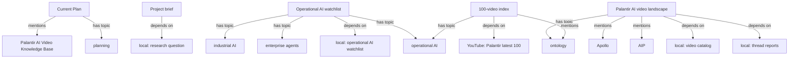

# Knowledge graph

This is the current KRAIL document, topic, entity, and source-dependency graph. The generated Mermaid source remains available in `graph.mmd`.

```mermaid
flowchart TD
  Plan["Current Plan"] -->|"has topic"| Planning["planning"]
  Plan -->|"mentions"| KB["Palantir AI Video Knowledge Base"]
  Brief["Project brief"] -->|"depends on"| Question["local: research question"]
  Watchlist["Operational AI watchlist"] -->|"depends on"| SourceInventory["local: operational AI watchlist"]
  Watchlist -->|"has topic"| OperationalAI["operational AI"]
  Watchlist -->|"has topic"| EnterpriseAgents["enterprise agents"]
  Watchlist -->|"has topic"| IndustrialAI["industrial AI"]
  Landscape["Palantir AI video landscape"] -->|"depends on"| Reports["local: thread reports"]
  Landscape -->|"depends on"| Catalog["local: video catalog"]
  Landscape -->|"has topic"| Ontology["ontology"]
  Landscape -->|"mentions"| AIP["AIP"]
  Landscape -->|"mentions"| Apollo["Apollo"]
  VideoIndex["100-video index"] -->|"depends on"| YouTube["YouTube: Palantir latest 100"]
  VideoIndex -->|"has topic"| OperationalAI
  VideoIndex -->|"mentions"| Ontology
```
