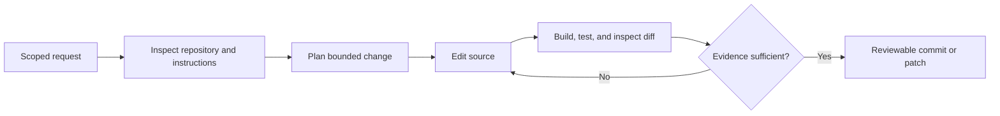

# AI Coding Agents

Coding agents plan and execute software work across repositories, shells, tests, documentation, issue trackers, and deployment systems. Their scope has expanded from completion to long-running delegated engineering.

## Operational concerns

- Repository instructions and environment discovery
- Sandboxed execution and secret boundaries
- Test-driven verification
- Reviewable diffs and source control
- Parallel task coordination
- Dependency and supply-chain safety
- Measurement of correctness rather than code volume

AGENTS.md provides a shared convention for project instructions. Coding-agent practices are also becoming a template for general knowledge-work agents: bounded tools, durable tasks, explicit artifacts, and verification before handoff.

## Verified engineering loop

| Control | Purpose | Evidence |
|---|---|---|
| Repository instructions | Preserve local conventions | AGENTS.md and project docs |
| Scoped permissions | Limit blast radius | Sandbox and tool policy |
| Tests | Check behavior | Passing targeted and regression suites |
| Diff review | Detect unintended change | Small explainable patch |
| Human merge gate | Retain accountability | Approved pull request |

## Worked example: formatting repair

An agent identifies a Markdown renderer that prints Mermaid and links as raw text, replaces it with a standards-compatible renderer, adds diagram support, normalizes link labels, builds both deployment targets, and adds regression tests. The artifact is the verified diff—not the agent's assertion that the page “looks fixed.”

## Common pitfalls

Large unreviewable diffs, tests written only to match the implementation, secret exposure, destructive source-control commands, and dependency churn are common failure modes. Prefer bounded changes and evidence proportional to risk.

## Quick review

- **Flashcard:** What is the primary handoff artifact? **Answer:** A reviewable change with verification evidence.
- **Question:** Why is code volume a poor productivity metric? **Answer:** Correctness, maintainability, and avoided change matter more.

## Sources and related pages

[AGENTS.md](https://agents.md/) · [Agentic AI Foundation](https://aaif.io/) · [[Agentic AI]] · [[Evaluation and Observability]]
