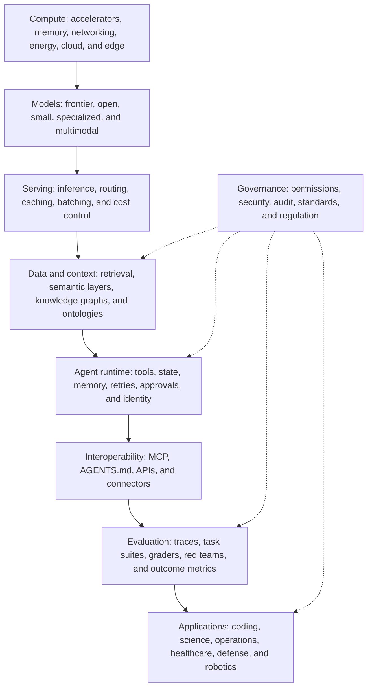

# AI Ecosystem Map

The AI ecosystem is best understood as a stack rather than a leaderboard.

1. **Compute:** accelerators, memory, networking, energy, cloud, edge, and sovereign infrastructure.
2. **Models:** frontier, open-weight, small, specialized, multimodal, and embodied models.
3. **Serving:** inference engines, routing, caching, batching, quantization, and cost controls.
4. **Data and context:** warehouses, lakehouses, retrieval, semantic layers, knowledge graphs, and ontologies.
5. **Agent runtime:** tool use, state, memory, retries, scheduling, approvals, and identity.
6. **Interoperability:** MCP, AGENTS.md, APIs, connectors, and agent-to-agent protocols.
7. **Evaluation:** traces, task suites, graders, red teams, outcome metrics, and production monitoring.
8. **Applications:** coding, research, operations, healthcare, defense, industry, science, and robotics.
9. **Governance:** permissions, security, audit, standards, regulation, and organizational accountability.

The primary competitive question is no longer only “which model is strongest?” It is “which system can turn capability into reliable, governed action at acceptable cost?”

Related: [[Operational AI]], [[AI Infrastructure]], [[Enterprise Agent Runtime]], [[AI Safety and Governance]].

## Worked example: an enterprise research agent

The agent uses a frontier model for synthesis, an open embedding model for retrieval, a governed warehouse and document index for evidence, MCP servers for tools, a durable runtime for long tasks, an evaluation suite for citation and factuality, and identity-aware policies for access. Each layer can change independently, but the full system must be evaluated together.

| If this layer fails | Observable symptom | Likely response |
|---|---|---|
| Context | Confident answer using stale facts | Fix freshness, lineage, and retrieval |
| Runtime | Lost work after interruption | Add durable state and idempotency |
| Evaluation | Regressions reach users | Add task cases and release gates |
| Governance | Correct but unauthorized action | Enforce identity and policy at tools |
| Infrastructure | Good results at unusable cost | Route, cache, batch, or use smaller models |

## Quick review

- **Flashcard:** What is the ecosystem's unit of competition? **Answer:** Increasingly the complete governed system, not only the base model.
- **Flashcard:** Where does semantic meaning live? **Answer:** In context layers such as semantic models, graphs, and ontologies.
- **Question:** A model upgrade improves benchmarks but breaks a tool workflow. Did the system improve? **Answer:** No; system-level task performance regressed.

## Sources and related pages

[Stanford AI Index](https://hai.stanford.edu/ai-index) · [Hugging Face Daily Papers](https://huggingface.co/papers) · [NIST AIRC](https://airc.nist.gov/) · [[Organizations and Platforms]]
