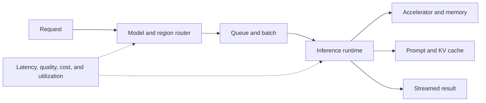

# AI Infrastructure

AI infrastructure includes accelerators, memory, networking, storage, energy, training systems, inference engines, clouds, edge runtimes, and deployment control planes.

## Why inference matters

Production economics depend on tokens per second, time to first token, concurrency, memory efficiency, routing, caching, batching, and utilization. Open serving projects such as vLLM and SGLang coexist with managed inference platforms and hardware-specific runtimes.

Sovereign and regulated deployments add requirements for locality, supply-chain control, audit, and consistent release across cloud, on-premises, and edge environments.

Related: [[Frontier and Open Models]], [[Operational AI]], [[Organizations and Platforms]].

## Serving path

| Optimization | Improves | Tradeoff |
|---|---|---|
| Batching | Throughput and utilization | Queue latency |
| Quantization | Memory and cost | Possible quality loss |
| Caching | Repeat-request latency | Freshness and isolation |
| Model routing | Cost-quality fit | Evaluation complexity |
| Edge deployment | Locality and resilience | Fleet operations burden |

## Worked example: sovereign agent service

A regulated operator routes sensitive tasks to an on-premises model runtime and low-risk tasks to a managed frontier API. The same application contract is deployed through controlled artifacts; telemetry is aggregated without exporting protected content. Verification includes failover, patch rollback, capacity saturation, and data-residency tests.

## Common pitfalls

Peak benchmark throughput rarely predicts mixed production traffic. Measure time to first token, tail latency, concurrency, memory pressure, energy, and total cost under representative prompts.

## Quick review

- **Flashcard:** Why can batching hurt interactive agents? **Answer:** Waiting for a batch increases latency.
- **Flashcard:** What does sovereignty add? **Answer:** Locality, supply-chain, accreditation, and fleet-control requirements.
- **Question:** A smaller model meets quality targets at one-fifth the cost. Which model is operationally better? **Answer:** The smaller model for that evaluated task.

## Sources and related pages

[vLLM](https://vllm.ai/) · [SGLang](https://github.com/sgl-project/sglang) · [NVIDIA AI infrastructure](https://www.nvidia.com/en-us/data-center/) · [[Frontier and Open Models]]
