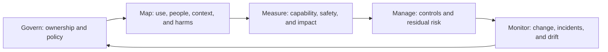

# AI Safety and Governance

AI governance assigns responsibility and controls risk across design, acquisition, testing, deployment, operation, and retirement.

## Control areas

- Intended use, prohibited use, and risk classification
- Data governance, privacy, provenance, and security
- Capability and safety evaluation
- Human oversight and appeal
- Incident reporting and audit trails
- Vendor, model, and supply-chain risk
- Continuous monitoring and change management

NIST's AI RMF uses the functions govern, map, measure, and manage. The EU AI Act applies progressively and its implementation details continue to change, so compliance dates and interpretations should be checked against current official sources.

Sources: [NIST AI RMF](https://www.nist.gov/itl/ai-risk-management-framework), [EU AI Act timeline](https://ai-act-service-desk.ec.europa.eu/en/ai-act/timeline/timeline-implementation-eu-ai-act).

## Governance lifecycle

| Control question | Evidence | Owner |
|---|---|---|
| What decision may the system influence? | Intended-use and prohibited-use record | Business owner |
| Who can be harmed? | Impact and threat assessment | Risk/domain team |
| Does it work safely enough? | Evaluation and red-team results | Technical owner |
| Who may approve and override it? | Role and escalation design | Operations owner |
| What happens after release? | Monitoring and incident plan | Service owner |

## Worked example: clinical review assistant

A hospital classifies the system as decision support, documents its intended users, evaluates subgroup errors, limits access to authorized reviewers, logs evidence and overrides, and prevents automatic denial or treatment action. A material model change triggers re-evaluation. Regulatory applicability is checked against current jurisdiction-specific guidance.

## Common pitfalls

A policy document without technical enforcement is not governance. Other failures include frozen risk assessments, no incident channel, treating vendor benchmarks as local validation, and unclear ownership at handoffs.

## Quick review

- **Flashcard:** What are the NIST AI RMF functions? **Answer:** Govern, map, measure, and manage.
- **Flashcard:** Why monitor official regulatory sources? **Answer:** Timelines, guidance, and obligations change.
- **Question:** Who owns a harmful action performed after an agent recommendation? **Answer:** Accountability must be assigned in the operating model; “the model” cannot own it.

## Sources and related pages

[NIST AI Resource Center](https://airc.nist.gov/) · [EU AI Act Service Desk](https://ai-act-service-desk.ec.europa.eu/) · [[Evaluation and Observability]]
