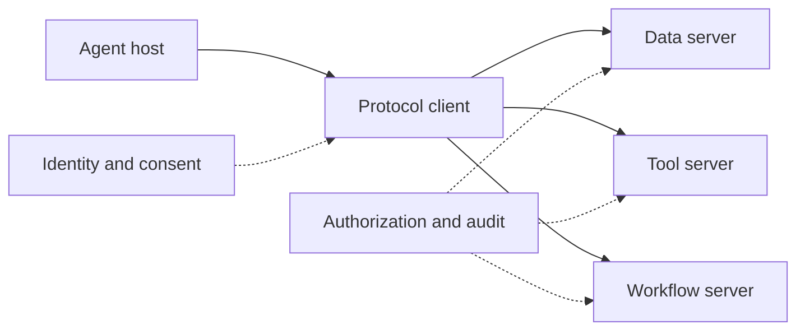

# Agent Interoperability

Interoperability standards reduce bespoke wiring between models, tools, repositories, and data systems.

## Important components

- **MCP:** a protocol for connecting AI applications to tools, data, and services.
- **AGENTS.md:** repository-local guidance for coding agents.
- **APIs and connectors:** conventional integration remains essential for authorization and transactional guarantees.
- **Agent protocols:** emerging approaches support delegation or communication across agent systems.

Anthropic donated MCP to the Linux Foundation's Agentic AI Foundation alongside OpenAI's AGENTS.md and Block's goose. Standardization improves portability but does not eliminate security design: every connection still needs authentication, authorization, input validation, and audit.

Sources: [AAIF announcement](https://www.linuxfoundation.org/press/linux-foundation-announces-the-formation-of-the-agentic-ai-foundation), [Anthropic announcement](https://www.anthropic.com/news/donating-the-model-context-protocol-and-establishing-of-the-agentic-ai-foundation).

## Connection model

| Mechanism | Standardizes | Does not guarantee |
|---|---|---|
| MCP | Tool, resource, and prompt discovery/exchange | Tool trust or correct authorization |
| AGENTS.md | Repository-local instructions | Agent compliance or code correctness |
| REST/event APIs | Service contracts and transactions | Shared semantic meaning |
| Agent-to-agent protocols | Delegation and message exchange | Goal alignment or result quality |

## Worked example: governed analytics

A research agent connects to a warehouse MCP server. Discovery exposes a query tool, but the server still evaluates the caller's identity, row-level access, allowed query class, and audit policy. The agent receives results plus provenance and cites them in a report. MCP removes bespoke client wiring; it does not replace the warehouse's security model.

## Common pitfalls

Treating protocol compatibility as trust is the central mistake. Other failures include unbounded tool descriptions, prompt injection through retrieved resources, credentials shared across users, and no version negotiation. Apply least privilege at the server, validate inputs and outputs, and log every consequential call.

## Quick review

- **Flashcard:** What problem does MCP solve? **Answer:** Standard connection between AI applications and tools or data.
- **Flashcard:** What remains local? **Answer:** Authentication, authorization, policy, validation, and audit.
- **Question:** Two tools implement MCP but use incompatible business definitions. Are they interoperable? **Answer:** Syntactically, perhaps; semantically, no.

## Sources and related pages

[Model Context Protocol](https://modelcontextprotocol.io/) · [Agentic AI Foundation](https://aaif.io/) · [[AI Safety and Governance]]
