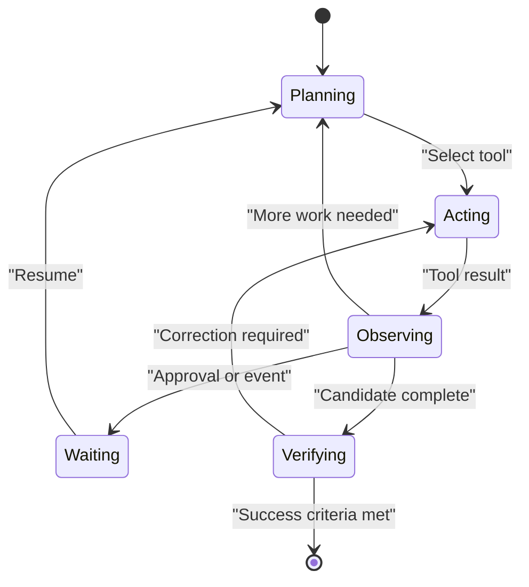

# Agentic AI

An AI agent is a model-centered system that can pursue a goal through multiple steps, select or call tools, observe results, maintain context, and adapt its plan. Autonomy is a spectrum: an agent may only draft, may act after approval, or may execute bounded actions independently.

## Production pattern

Goal → plan → tool call → observation → state update → evaluation → approval or next action.

Useful agents combine probabilistic reasoning with deterministic software. They need explicit tool contracts, constrained permissions, termination rules, durable state, and recovery paths. Multi-agent designs can parallelize or specialize work, but also increase coordination cost and failure surfaces.

Related: [[Enterprise Agent Runtime]], [[Agent Interoperability]], [[Evaluation and Observability]], [[AI Coding Agents]].

## Mental model

| Design | Strength | Limitation | Best fit |
|---|---|---|---|
| Single agent | Simple state and accountability | One context can become overloaded | Bounded workflows |
| Router plus specialists | Clear task specialization | Routing errors | Distinct task families |
| Multi-agent team | Parallel exploration | Coordination and cost | Decomposable research or engineering |
| Deterministic workflow with model steps | Predictable control flow | Less adaptive | Regulated recurring processes |

## Worked example: invoice audit

An audit agent ingests an invoice, retrieves the relevant lease and repair terms, extracts claimed work, compares it with contract rules, flags exceptions, and prepares a reviewer packet. The model handles ambiguous language; deterministic checks handle arithmetic and policy thresholds; a person approves any financial adjustment. Verification compares the final finding with labeled historical cases.

## Failure modes

Tool loops, silent permission expansion, context drift, premature completion, and unverifiable delegation are common. Bound tool calls, define termination criteria, preserve a typed task state, and require artifacts that another process can inspect.

## Quick review

- **Flashcard:** What makes an agent different from a chatbot? **Answer:** Multi-step goal pursuit using tools, observations, and state.
- **Flashcard:** When is multi-agent design justified? **Answer:** When work is genuinely decomposable and coordination cost is lower than the parallelism benefit.
- **Question:** Why keep deterministic code inside an agent system? **Answer:** Stable rules and calculations are cheaper, repeatable, and easier to verify.

## Sources and related pages

[OpenAI Agents SDK](https://openai.github.io/openai-agents-python/) · [Anthropic engineering](https://www.anthropic.com/engineering) · [[Enterprise Agent Runtime]] · [[Evaluation and Observability]]
