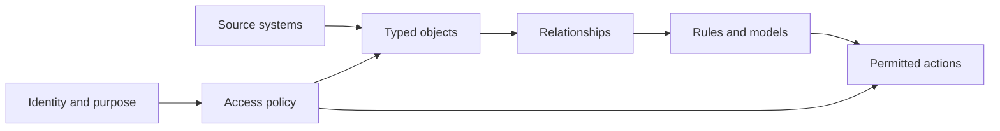

# Context and Ontologies

Context determines what an agent knows about the task, organization, user, and current state. An ontology adds explicit business meaning: typed objects, relationships, rules, actions, ownership, and permissions.

## Why it matters

- Retrieval supplies relevant information; an ontology can also define valid operational structure and permitted action.
- Shared semantics reduce ambiguity across agents, applications, and people.
- Permission-aware context can prevent an agent from seeing or changing data beyond its authority.
- Versioned operational models support audit, simulation, and controlled promotion.

Ontologies are not automatically correct. They require governance, stewardship, lineage, and continuous reconciliation with source systems.

Related: [[Enterprise Data and Knowledge]], [[Operational AI]], [[AI Safety and Governance]].

## From records to permitted action

| Layer | Example | Question it answers |
|---|---|---|
| Record | `shipment 481` | What data exists? |
| Semantic object | Delayed inbound vessel | What does it mean operationally? |
| Relationship | Supplies refinery unit 3 | What depends on it? |
| Logic | Minimum inventory and quality rules | What is valid? |
| Action | Rebuild and approve schedule | What may be changed? |

## Worked example: hospital discharge

A patient record alone does not define discharge readiness. The ontology connects the patient, care team, tests, medications, bed state, transport, follow-up requirements, and approval rights. An agent may draft the plan and wait for a physician sign-off; it must not infer that a completed test grants authority to discharge.

## Common pitfalls

Treating an ontology as a static taxonomy produces labels without operational value. Copying source schemas preserves technical fragmentation. Over-centralizing ownership makes the model stale. Use domain stewardship, versioning, lineage, reconciliation, and explicit action semantics.

## Quick review

- **Flashcard:** How does an ontology differ from retrieval? **Answer:** Retrieval finds relevant evidence; an ontology also expresses domain structure, rules, and allowable action.
- **Flashcard:** Why include permissions in context? **Answer:** What an agent may know and do depends on identity, purpose, and role.
- **Question:** A graph links customers to orders but defines no actions or policy. What is missing? **Answer:** The operational and governance layers.

## Sources and related pages

[Palantir Ontology overview](https://www.palantir.com/docs/foundry/ontology/overview/) · [Watch the Ontology presentation](https://www.youtube.com/watch?v=YDAxITCNcko) · [[Enterprise Data and Knowledge]]
