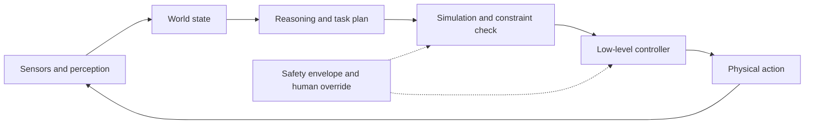

# Embodied and Industrial AI

Embodied AI connects perception, reasoning, planning, and control to physical systems. Examples include robots, vehicles, factories, field operations, logistics, and infrastructure maintenance.

Google DeepMind describes Gemini Robotics as combining embodied reasoning with vision-language-action models. Industrial AI also relies on simulation, digital twins, sensor data, deterministic control, and safety envelopes.

## Higher-stakes requirements

- Success and failure detection
- Simulation and staged deployment
- Real-time and edge constraints
- Human override and safe-stop behavior
- Hardware-aware testing
- Clear accountability for physical outcomes

Source: [Google DeepMind Gemini Robotics](https://deepmind.google/models/gemini-robotics/).

## Sense–reason–act loop

| Layer | Typical method | Failure concern |
|---|---|---|
| Perception | Vision-language model | Missed or misidentified object |
| Reasoning | Multimodal foundation model | Invalid plan |
| Simulation | Digital twin or scenario model | Reality gap |
| Control | Deterministic/VLA controller | Unsafe trajectory |
| Supervision | Safety system and operator | Slow or unavailable override |

## Worked example: factory inspection

A mobile robot receives an inspection route, identifies a gauge, reads the value, compares it with the asset's operating range, and proposes a maintenance action. Uncertain perception triggers another viewpoint; an out-of-bounds value is confirmed by a deterministic sensor before a work order is created. The robot may navigate autonomously, but shutdown authority remains separately controlled.

## Common pitfalls

Simulation success does not guarantee physical safety. Distribution shift, calibration error, network loss, actuator wear, and ambiguous human presence require explicit fallbacks.

## Quick review

- **Flashcard:** What is a VLA? **Answer:** A vision-language-action model connecting perception and instructions to actions.
- **Flashcard:** Why separate reasoning from safety control? **Answer:** Probabilistic plans should not be the only physical safety boundary.
- **Question:** A robot cannot confirm whether a valve moved. What should it do? **Answer:** Detect uncertainty, retry or request inspection, and avoid assuming success.

## Sources and related pages

[Gemini Robotics](https://deepmind.google/models/gemini-robotics/) · [Physical Intelligence](https://www.physicalintelligence.company/blog) · [[Operational AI]]
