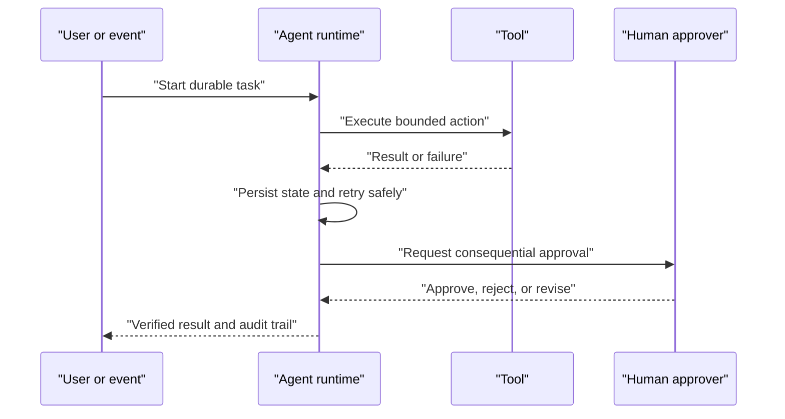

# Enterprise Agent Runtime

A production agent runtime supplies the non-model capabilities needed for reliable delegated work.

## Core capabilities

- Durable state and resumable execution
- Scheduling, retries, timeouts, and idempotency
- Tool isolation and credential boundaries
- Human approval and escalation
- Memory and context management
- Tracing, cost accounting, and policy enforcement
- Versioning and controlled deployment

OpenAI's 2026 enterprise and Amazon Bedrock announcements emphasize shared context, permissions, state, reliability, and governance. Temporal, cloud platforms, data platforms, and agent frameworks approach the same problem from different layers.

Related: [[Agentic AI]], [[Evaluation and Observability]], [[Agent Interoperability]].

## Runtime lifecycle

| Capability | Runtime responsibility | Test |
|---|---|---|
| Durability | Resume after process loss | Terminate mid-step and recover |
| Idempotency | Prevent duplicate effects | Replay the same event |
| Approval | Pause without consuming compute | Delay decision for days |
| Isolation | Limit credentials and tools | Attempt an unauthorized call |
| Observability | Preserve trace and cost | Reconstruct a failed run |

## Worked example: long-running discharge task

An agent prepares a discharge plan, requests physician approval, and is terminated while waiting. A durable runtime rehydrates the exact task state after approval arrives, checks whether downstream actions already occurred, and resumes without duplicating notifications or orders. This is the behavior claimed in Palantir's Orchestrator launch; independent reliability evidence is not supplied. [Watch the launch](https://www.youtube.com/watch?v=ZTw66mjYATo).

## Pitfalls and decision rules

Do not confuse conversation memory with durable workflow state. Persist task identity, tool effects, approvals, and versioned context. Choose a runtime only after testing crash recovery, duplicate events, expired credentials, human delay, and partial external failure.

## Quick review

- **Flashcard:** What is durable execution? **Answer:** Work can resume from persisted state after interruption.
- **Flashcard:** Why is idempotency essential? **Answer:** Retries must not repeat side effects.
- **Question:** An approval wait keeps a worker and GPU allocated. What runtime property is missing? **Answer:** Suspendable durable waiting.

## Sources and related pages

[OpenAI and Amazon stateful runtime](https://openai.com/index/introducing-the-stateful-runtime-environment-for-agents-in-amazon-bedrock/) · [Temporal](https://temporal.io/) · [[Agentic AI]]
