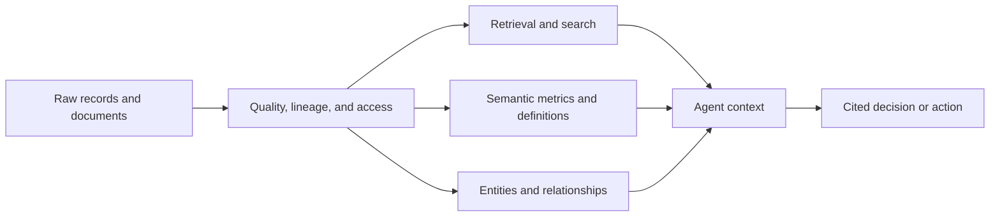

# Enterprise Data and Knowledge

Enterprise agents need more than document search. They may reason across structured tables, unstructured content, event streams, policies, definitions, lineage, and live application state.

## Main approaches

- Warehouses and lakehouses for governed analytical data
- Retrieval systems for unstructured evidence
- Semantic layers for business definitions and metrics
- Knowledge graphs for entities and relationships
- Ontologies for operational objects, actions, and permissions
- Data contracts and lineage for trust and change management

Snowflake, Databricks, Microsoft, Google Cloud, AWS, and Palantir increasingly frame the data layer as the context and control plane for agents.

Related: [[Context and Ontologies]], [[Operational AI]], [[Organizations and Platforms]].

## Knowledge supply chain

| Need | Best starting layer | Example |
|---|---|---|
| Find supporting passages | Retrieval | Locate contract clauses |
| Answer governed metric questions | Semantic layer | Revenue by approved definition |
| Traverse dependencies | Knowledge graph | Supplier-to-part relationships |
| Execute domain action | Ontology/action layer | Reschedule a constrained order |

## Worked example: supply disruption

An agent receives a supplier delay. Retrieval finds the notice and contract; the semantic layer calculates exposure using approved metrics; the graph identifies dependent parts and orders; the operational model exposes permitted alternatives. The final recommendation cites the notice, shows affected objects, and routes the change for approval.

## Failure modes

Vector search alone can retrieve plausible but outdated passages. A semantic layer without lineage can produce consistent but untrustworthy metrics. A graph without stewardship accumulates broken identities. Record freshness, ownership, access, source timestamps, and citation must travel with agent context.

## Quick review

- **Flashcard:** Which layer answers “what does revenue mean?” **Answer:** A governed semantic layer.
- **Flashcard:** Which layer answers “what depends on this supplier?” **Answer:** A relationship or knowledge graph.
- **Question:** Why combine retrieval and structured data? **Answer:** Evidence often spans narrative clauses and exact operational state.

## Sources and related pages

[Snowflake Cortex AI](https://www.snowflake.com/en/product/features/cortex/) · [Databricks AI](https://www.databricks.com/product/artificial-intelligence) · [[Context and Ontologies]]
