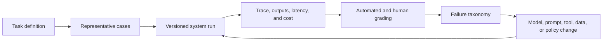

# Evaluation and Observability

Evaluation asks whether an AI system performs the intended task. Observability explains what happened during a particular run.

## Evaluation layers

- Model capability and safety benchmarks
- Tool-use and agent task suites
- Domain-specific offline test cases
- Human review and pairwise preference
- Production quality, latency, cost, and business outcomes
- Incident, drift, and regression monitoring

METR studies the duration of tasks agents can complete at defined reliability. NIST's AI RMF organizes risk work around govern, map, measure, and manage. Production teams also need traces, replayable runs, graders, failure taxonomies, and release gates.

Sources: [METR](https://metr.org/), [NIST AIRC](https://airc.nist.gov/), [MLCommons](https://mlcommons.org/).

## Evaluation loop

| Layer | Measures | Example failure |
|---|---|---|
| Model | Capability on isolated inputs | Incorrect extraction |
| Agent | Multi-step task completion | Wrong tool sequence |
| Workflow | Domain outcome and control | Approval bypass |
| Production | Drift, incidents, latency, cost | Quality regression after data change |

## Worked example: utilization review optimization

A hospital workflow defines labeled review cases, clinical-quality criteria, latency, and per-case cost. Candidate changes include another model, rewritten prompts, structured data, and deterministic substitutions. Experts compare outputs blind; production monitoring then checks whether the winning configuration retains quality. Palantir reports this pattern for Tampa General, but the claimed percentages remain attributed. [Watch the presentation](https://www.youtube.com/watch?v=WLleqr4GEAw).

## Common pitfalls

Benchmark-only evaluation ignores the actual workflow. LLM-as-judge scores can inherit model bias. Average accuracy hides high-impact failure classes. Production traces without outcome labels explain execution but not success. Combine fixed regression cases, adversarial cases, human review, operational metrics, and incident analysis.

## Quick review

- **Flashcard:** Evaluation versus observability? **Answer:** Evaluation judges performance; observability reconstructs behavior.
- **Flashcard:** Why version the whole system? **Answer:** Model, prompt, tool, context, and policy changes can each alter outcomes.
- **Question:** A new model improves average quality but doubles critical false negatives. Should it ship? **Answer:** Not without resolving the high-impact regression.

## Sources and related pages

[NIST AI RMF](https://www.nist.gov/itl/ai-risk-management-framework) · [METR](https://metr.org/) · [MLCommons](https://mlcommons.org/) · [[AI Safety and Governance]]
