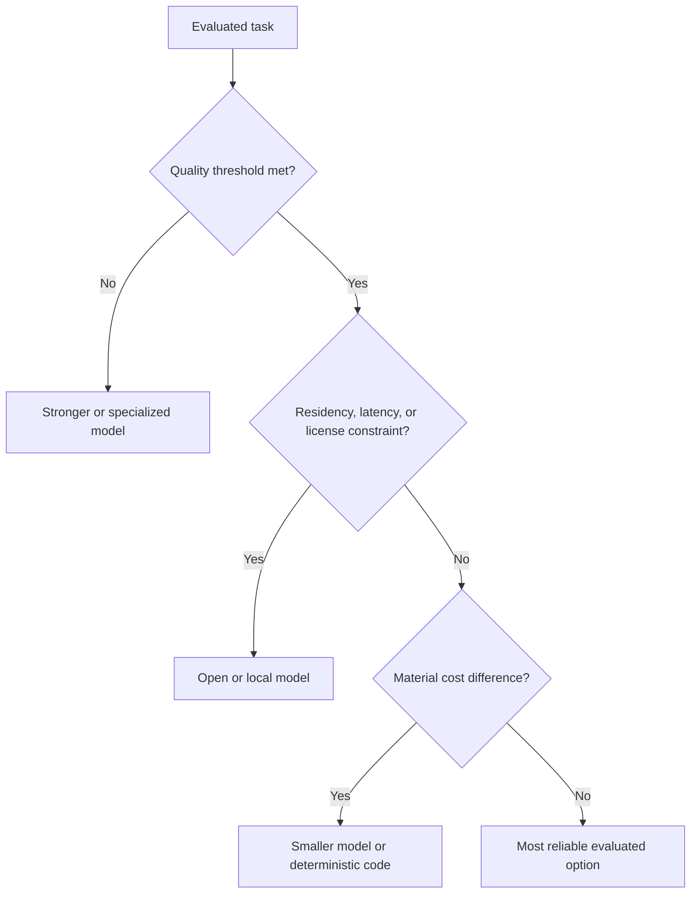

# Frontier and Open Models

The model layer includes closed frontier APIs, open-weight models, small specialized models, multimodal systems, and domain-tuned components.

## Selection dimensions

- Task quality and reliability
- Latency and throughput
- Total inference and integration cost
- Context length and tool use
- Fine-tuning and deployment flexibility
- Data residency, licensing, and sovereignty
- Safety controls and evaluation evidence

Strong operational systems increasingly use portfolios: a frontier model for difficult reasoning, smaller models for routine tasks, deterministic code for stable logic, and specialized perception or control models for physical work.

Related: [[AI Infrastructure]], [[Evaluation and Observability]], [[Operational AI]].

## Portfolio decision

| Model class | Strength | Limitation | Typical role |
|---|---|---|---|
| Frontier API | Strong general reasoning | Cost, control, residency | Difficult planning and synthesis |
| Open-weight | Deployment and tuning flexibility | Operations and license review | Sovereign or customized workloads |
| Small model | Low latency and cost | Narrower capability | Routing, extraction, classification |
| Specialized model | Domain performance | Limited transfer | Vision, embeddings, control, science |
| Deterministic code | Repeatability | No flexible reasoning | Stable rules and calculations |

## Worked example: document workflow

A small local model classifies documents, deterministic code validates identifiers, a frontier model interprets ambiguous exceptions, and a human approves consequential changes. Routing is based on evaluated difficulty rather than vendor preference.

## Common pitfalls

Leaderboard scores do not establish workflow fitness. Test real inputs, tool behavior, refusal patterns, latency, cost, and failure severity. Re-evaluate when models or prompts change.

## Quick review

- **Flashcard:** Why use a model portfolio? **Answer:** Tasks have different quality, cost, latency, and governance needs.
- **Question:** When should deterministic code replace a model? **Answer:** When the rule is stable, fully specified, and easier to verify in code.

## Sources and related pages

[Hugging Face models](https://huggingface.co/models) · [Google DeepMind](https://deepmind.google/models/) · [Anthropic models](https://www.anthropic.com/claude) · [[AI Infrastructure]]
