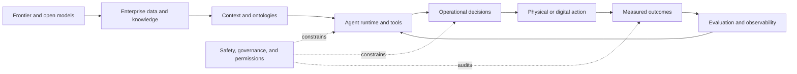

# Operational AI Field Wiki

Operational AI is the layer where models stop being isolated prediction or chat systems and begin participating in real work. This wiki connects a 100-video Palantir corpus to the wider ecosystem of models, agents, data infrastructure, ontologies, evaluation, governance, robotics, and organizational deployment.

The central claim is simple: a capable model is only one component of a dependable operational system. Reliable action also requires shared context, bounded tools, permissions, observable workflows, human judgment, and evidence that the system improves a real outcome.

## How the field fits together

This loop is the organizing model for the wiki. Models propose; enterprise context grounds; agents coordinate; controls bound; operators decide; systems act; and evaluation feeds the result back into the next cycle.

## Choose a learning path

| If you want to understand… | Begin with | Continue through | Finish with |
|---|---|---|---|
| The complete technology landscape | [[AI Ecosystem Map]] | [[Frontier and Open Models]] → [[AI Infrastructure]] | [[Organizations and Platforms]] |
| How agents perform delegated work | [[Agentic AI]] | [[AI Coding Agents]] → [[Enterprise Agent Runtime]] | [[Agent Interoperability]] |
| Why enterprise context matters | [[Enterprise Data and Knowledge]] | [[Context and Ontologies]] | [[Operational AI]] |
| How to evaluate claims and control risk | [[Evaluation and Observability]] | [[AI Safety and Governance]] | [[Evidence and Method]] |
| How AI reaches the physical world | [[Embodied and Industrial AI]] | [[Sectors and Use Cases]] | [[Palantir Video Corpus]] |
| What to monitor next | [[Research and Monitoring Sources]] | [[Organizations and Platforms]] | [[Glossary]] |

## The operational AI stack

| Layer | Core question | Typical components | Main failure mode |
|---|---|---|---|
| Model capability | What can the system infer, generate, or plan? | Foundation models, specialist models, multimodal models | Impressive output without task reliability |
| Context | What does the organization know right now? | Data products, knowledge graphs, ontologies, retrieval, policies | Stale, incomplete, or contradictory reality |
| Runtime | How is work decomposed and executed? | Agents, tools, memory, state, orchestration, queues | Unbounded loops, brittle handoffs, hidden state |
| Control | What is permitted, reviewed, and attributable? | Identity, permissions, approvals, sandboxes, audit logs | Excess authority or unclear accountability |
| Action | How does a recommendation change the world? | APIs, workflow write-back, schedules, dispatch, robots | A correct suggestion that never reaches execution |
| Outcome | Did the intervention actually help? | Evaluations, telemetry, experiments, operator feedback | Measuring fluency instead of operational value |

The stack is not a maturity ladder. Every production system needs some version of every layer, even when one product hides several layers behind a single interface.

## Start with the core concepts

- [[AI Ecosystem Map]] — the whole stack and its major actors at a glance
- [[Operational AI]] — what changes when AI participates in live operations
- [[Agentic AI]] — agents, tools, state, memory, and delegated work
- [[Context and Ontologies]] — the shared representation behind reliable action
- [[Evaluation and Observability]] — how behavior and outcomes are measured
- [[AI Safety and Governance]] — how authority, risk, and accountability are bounded
- [[Palantir Video Corpus]] — what the 100 source videos cover
- [[Research and Monitoring Sources]] — the broader intelligence watchlist

## What is inside this knowledge base

| Collection | Coverage | Best use |
|---|---:|---|
| Palantir video corpus | 100 recent channel videos | Identify products, deployment patterns, partners, sectors, and recurring claims |
| Transcript-backed reviews | 25 videos | Inspect the strongest available summaries and direct content evidence |
| Metadata-backed reviews | 75 videos | Map topics and claims while retaining lower-confidence labels |
| External monitoring sources | 77 sources | Track labs, engineering teams, policy bodies, standards groups, and independent analysis |
| Terra second-pass reviews | 3 corpus-wide audits | Compare architecture, evidence quality, and ecosystem-level conclusions |
| Field wiki | 20 connected concept pages | Learn the underlying ideas and move from a source claim to a system-level explanation |

## Worked example: from disruption to decision

Imagine a manufacturer learns that a critical shipment will arrive four days late.

1. [[Enterprise Data and Knowledge]] supplies inventory, orders, supplier status, production plans, and customer commitments.
2. [[Context and Ontologies]] represents how parts, factories, orders, machines, and policies relate to one another.
3. [[Agentic AI]] explores options such as reallocating stock, changing a schedule, qualifying an alternate supplier, or notifying customers.
4. [[Enterprise Agent Runtime]] manages tool calls, intermediate state, retries, and the handoff between specialist agents.
5. [[AI Safety and Governance]] limits which changes may be automatic and which require an operator's approval.
6. [[Operational AI]] writes an approved plan back into scheduling, procurement, and communication systems.
7. [[Evaluation and Observability]] measures service level, delay avoided, cost, operator overrides, and unexpected effects.

The useful unit is therefore not “a model answer.” It is a governed decision loop that connects evidence to action and action to a measurable result.

## Evidence convention

Product announcements establish what an organization says it is building. They do not independently establish safety, effectiveness, causality, or customer outcomes. The wiki keeps these evidence levels distinct.

| Evidence label | What it supports | What it does not prove |
|---|---|---|
| Transcript-backed | The video explicitly says or demonstrates the claim | Independent effectiveness or generalizability |
| Official metadata | The publisher's title, description, or linked material makes the claim | That the implementation works as described |
| Attributed outcome | A named customer or partner reports a result | Causality, unless the evaluation design supports it |
| Independently corroborated | A regulator, benchmark, paper, filing, or third party supports the claim | Universal performance in other settings |
| Inference | The conclusion follows from multiple observed signals | Direct confirmation; it should remain provisional |

See [[Evidence and Method]] for the full research contract and confidence rules.

## Common reading mistakes

| Mistake | Better question |
|---|---|
| Treating a demo as production evidence | What changed under real load, real permissions, and real failure conditions? |
| Treating an agent as only a prompt | Where do state, tools, retries, budgets, and human escalation live? |
| Treating ontology as a taxonomy | Does it encode operational objects, relationships, rules, actions, and permissions? |
| Treating autonomy as all-or-nothing | Which decisions are reversible, observable, and safe to delegate? |
| Treating a claimed outcome as causal proof | What baseline, counterfactual, or independent evidence supports the result? |

## Quick review

**What separates operational AI from a conventional assistant?**
It participates in a controlled workflow that can read current context, use tools, change system state, and be evaluated against an operational outcome.

**Why are ontologies repeatedly important?**
They give models and people a shared representation of the entities, relationships, constraints, and actions that define the real operation.

**Why is observability part of the product rather than an add-on?**
Agent behavior is probabilistic and stateful. Operators need traces, evaluations, costs, exceptions, and outcomes to improve it safely.

**What should you verify first when reading a vendor claim?**
Identify who made the claim, what evidence is available, whether the result was independently corroborated, and whether the metric reflects real operational value.

## Primary reference points

- [Palantir AIP documentation](https://www.palantir.com/docs/foundry/aip/overview/) — the vendor's description of its AI platform and operational workflows
- [NIST AI Risk Management Framework](https://www.nist.gov/itl/ai-risk-management-framework) — a general framework for governing and measuring AI risk
- [Agentic AI Foundation](https://aaif.io/) — open infrastructure and interoperability work for agent systems
- [METR](https://metr.org/) — independent research on frontier-model capabilities, autonomy, and evaluation

Continue with [[AI Ecosystem Map]] for the broadest view, or open [[Glossary]] when a term is unfamiliar.
