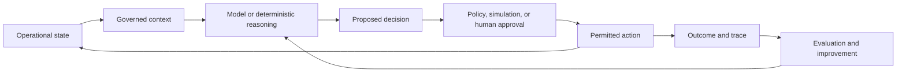

# Operational AI

Operational AI connects model outputs to decisions and actions inside a live organization or physical system. Its unit of value is not generated prose but a completed, reviewable change: a revised schedule, dispatched resource, validated plan, resolved case, updated record, or controlled machine action.

## Recurring requirements

- A current representation of operational objects, relationships, rules, and permissions.
- Tools that can read and write governed systems.
- Durable workflows that survive timeouts, failures, and human delays.
- Sandboxes, approvals, attribution, and rollback for consequential actions.
- Task-specific evaluation tied to cost, quality, speed, safety, or mission outcomes.

The Palantir corpus presents the Ontology, Agent Engine, Orchestrator, Observability, and Apollo as one version of this stack. Comparable ecosystem efforts emphasize governed enterprise context, stateful runtimes, and agent control planes.

Related: [[Context and Ontologies]], [[Enterprise Agent Runtime]], [[Sectors and Use Cases]].

## How the loop works

The loop closes only when an approved action changes the operation and the result becomes new evidence.

| Stage | Output | Essential control | Failure if missing |
|---|---|---|---|
| Context | Current objects, rules, and permissions | Lineage and access control | Plausible decisions about the wrong state |
| Reasoning | Ranked plan or recommendation | Tool contracts and constraints | Unbounded or unverifiable proposals |
| Decision gate | Approved, rejected, or revised action | Human/policy accountability | Automation without ownership |
| Execution | Idempotent write-back | Audit, rollback, and recovery | Duplicate or irreversible side effects |
| Evaluation | Outcome and failure evidence | Task-specific metrics | No reliable improvement loop |

## Worked example: refinery disruption

A delayed vessel invalidates a refinery's blending schedule. An operational agent reads the current vessel, inventory, quality, and production constraints; builds alternatives in a protected scenario; validates each plan; and presents the best feasible schedule for approval. Only the approved branch is merged into the live operation. The example is based on Palantir's HD Hyundai Oilbank presentation; the architecture is supported by the publisher description, while performance impact remains unverified. [Watch the official presentation](https://www.youtube.com/watch?v=mZcpr3vX_XY).

## Common pitfalls

| Pitfall | Symptom | Mitigation |
|---|---|---|
| Chat interface mistaken for an operating system | Good answers, no completed work | Define action contracts and system-of-record write-back |
| Stale context | Correct logic applied to old state | Version context and check freshness before action |
| LLM used for stable rules | Higher cost and inconsistent outputs | Substitute deterministic code where possible |
| Autonomy without recovery | Partial work or duplicate actions | Use durable state, idempotency, and compensating actions |

## Quick review

- **Flashcard:** What distinguishes operational AI? **Answer:** It converts governed context into controlled, observable action.
- **Flashcard:** Why is write-back high risk? **Answer:** It changes real systems and can create duplicate or irreversible effects.
- **Question:** A system produces accurate maintenance recommendations but never updates work orders. Is it operational AI? **Answer:** It is decision support, but the operational loop is not closed.

## Sources and related pages

[Palantir AIP documentation](https://www.palantir.com/docs/foundry/aip/overview/) · [OpenAI Frontier](https://openai.com/index/introducing-openai-frontier/) · [[Context and Ontologies]] · [[Enterprise Agent Runtime]]
